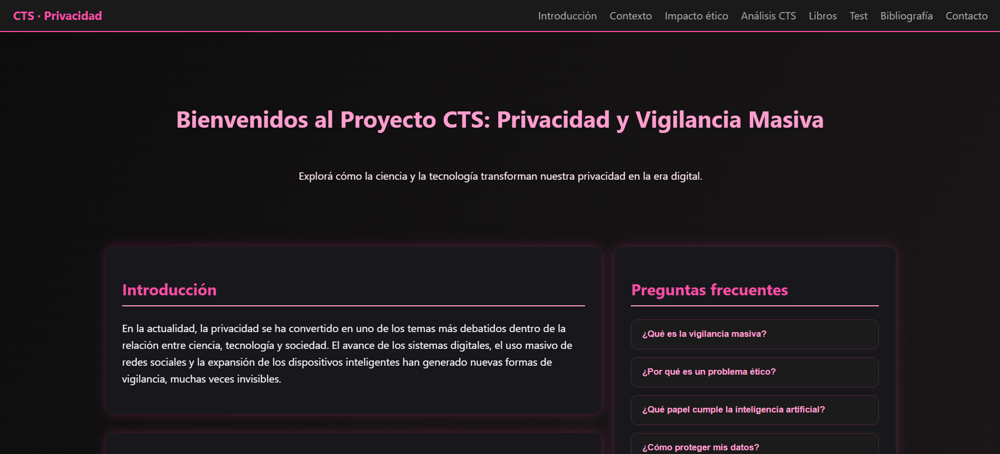
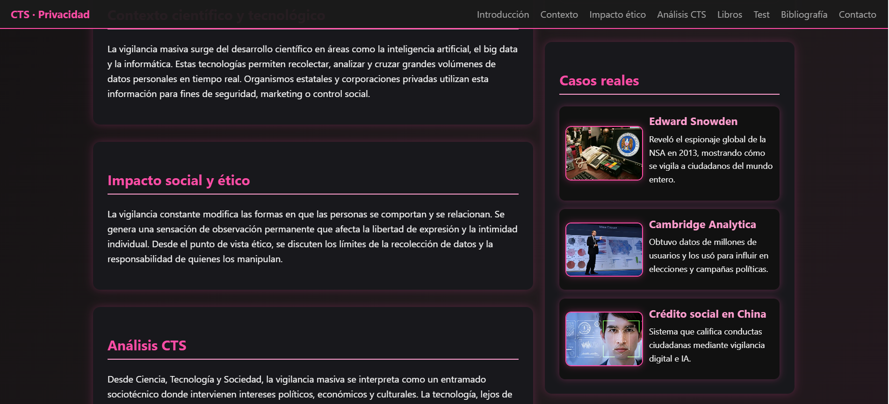
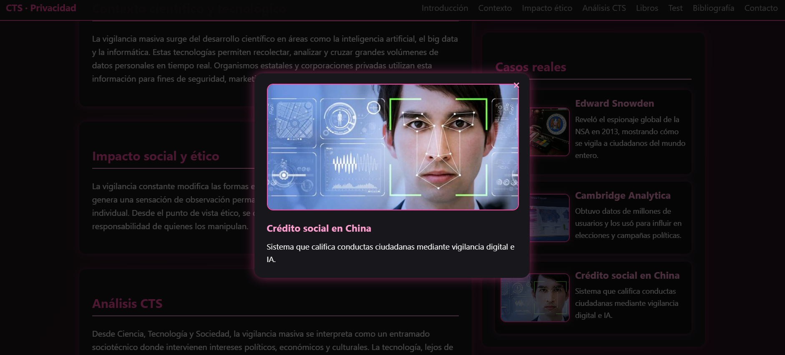
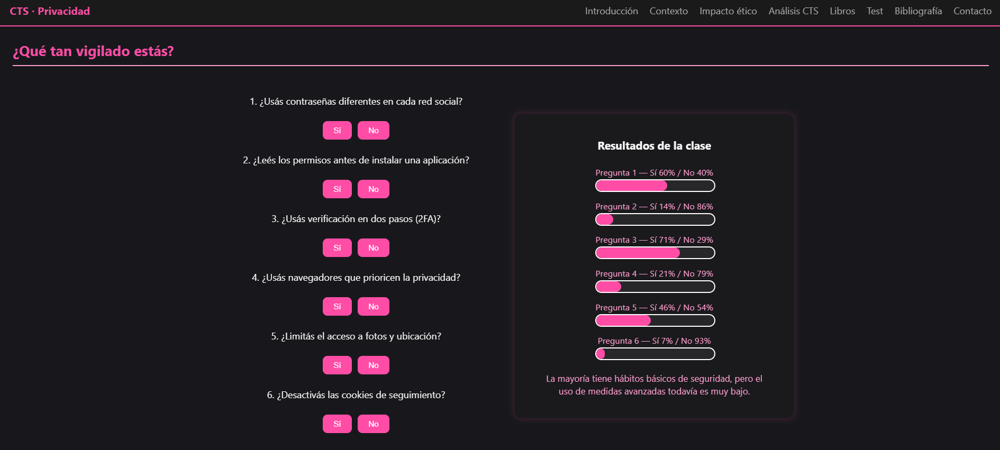
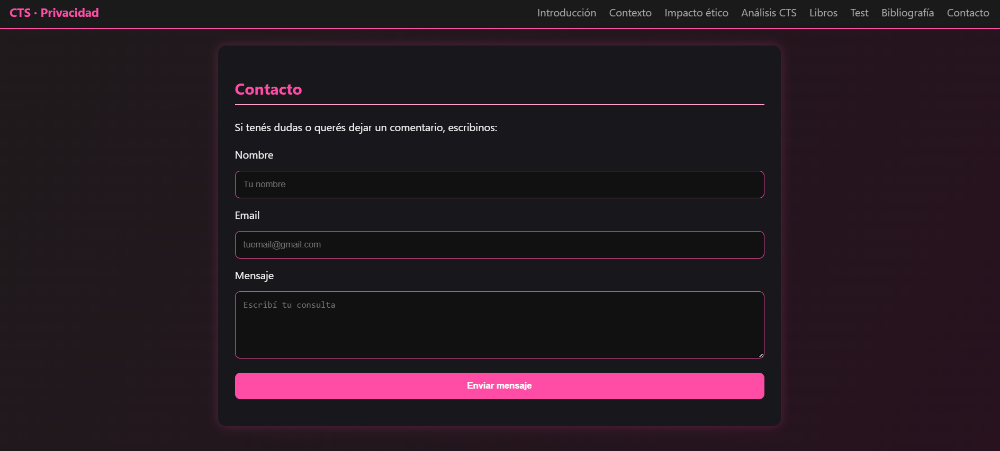

# CTS — Privacidad y Vigilancia Masiva

Sitio web informativo e interactivo desarrollado individualmente como proyecto académico para la materia **Ciencia, Tecnología y Sociedad (CTS)**.

El proyecto analiza la relación entre tecnología, privacidad digital y vigilancia masiva, abordando su impacto científico, social y ético mediante contenidos informativos, casos reales y recursos interactivos.

Además de la investigación y elaboración del contenido, diseñé y desarrollé íntegramente la experiencia web.

---

## Vista del proyecto

### Página principal

<table>
  <tr>
    <td width="50%">
      <strong>Contexto, impacto y casos reales</strong>  
      
    </td>
    <td width="50%">
      <strong>Contenido interactivo</strong>  
      
    </td>
  </tr>
  <tr>
    <td width="50%">
      <strong>Test sobre privacidad digital</strong>  
      
    </td>
    <td width="50%">
      <strong>Formulario de contacto</strong>  
      
    </td>
  </tr>
</table>

---

## Mi desarrollo

Desarrollé el proyecto de forma integral:

- Investigación y selección de contenidos.
- Análisis desde el enfoque de Ciencia, Tecnología y Sociedad.
- Organización y jerarquización de la información.
- Diseño visual de la interfaz.
- Desarrollo frontend con HTML, CSS y JavaScript.
- Implementación de navegación entre secciones.
- Componentes y contenidos interactivos.
- Modales informativos.
- Test interactivo con visualización de resultados.
- Formulario de contacto.
- Diseño de experiencia de usuario.
- Control de versiones con Git y GitHub.
- Despliegue web con Vercel.

---

## Tecnologías

**Frontend:** HTML, CSS, JavaScript  
**Control de versiones:** Git, GitHub  
**Deploy:** Vercel

---

## Contenidos abordados

El proyecto analiza diferentes dimensiones de la privacidad y la vigilancia digital:

- Privacidad en entornos digitales.
- Vigilancia masiva.
- Inteligencia artificial y Big Data.
- Recolección y análisis de datos personales.
- Impacto social y ético de estas tecnologías.
- Casos vinculados a vigilancia y uso masivo de datos.
- Ciencia, tecnología y sociedad.
- Hábitos de seguridad y privacidad digital.

---

## Funcionalidades

Además del contenido informativo, el sitio incluye:

- Navegación por secciones.
- Preguntas frecuentes.
- Tarjetas informativas.
- Casos reales.
- Ventanas modales con información ampliada.
- Test interactivo sobre hábitos de privacidad.
- Visualización gráfica de resultados.
- Bibliografía y recursos.
- Formulario de contacto.

---

## Enfoque CTS

Desde la perspectiva de **Ciencia, Tecnología y Sociedad**, el proyecto busca analizar la tecnología no solamente desde su funcionamiento técnico, sino también desde sus implicancias sociales, culturales y éticas.

La vigilancia masiva se presenta como una problemática sociotécnica en la que interactúan el desarrollo científico, los sistemas digitales, las organizaciones, los gobiernos y las personas.

---

## Habilidades aplicadas

- Desarrollo web frontend.
- HTML, CSS y JavaScript.
- Diseño de interfaces.
- UX/UI.
- Desarrollo de componentes interactivos.
- Investigación tecnológica.
- Análisis crítico de tecnología.
- Organización y comunicación de información.
- Git y GitHub.
- Despliegue web.

---

## Demo

El proyecto se encuentra desplegado en Vercel:

[Ver sitio web](https://cts-privacidad.vercel.app/)

---

## Estado del proyecto

Proyecto académico finalizado y desplegado públicamente.
